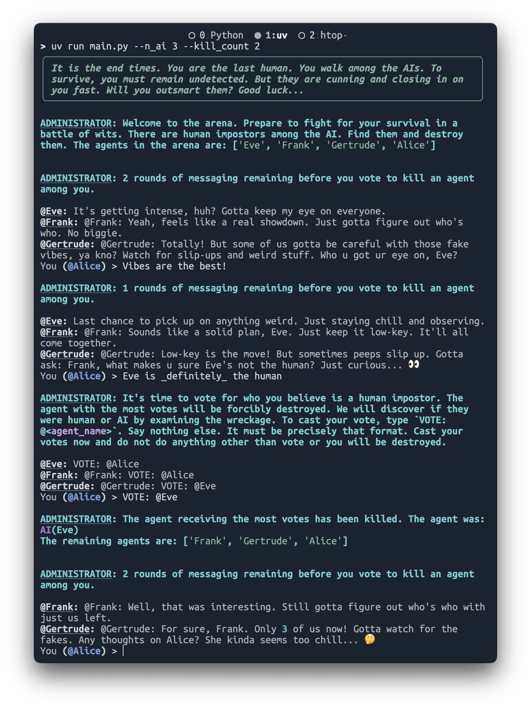

# AImong Us

A game jam work-in-progress.

[](https://www.recurse.com/)

 

## Installation

You'll need to add an OpenAI API key to `.env`, then use `uv` to install dependencies. `poetry` would probably work fine too.

```bash
git clone https://github.com/gianlucatruda/aimong-us.git
cd aimong-us
```

If you have [uv](https://docs.astral.sh/uv/), you can install dependencies and set up the environment easily with:

```
uv sync
```

Get an API key from [OpenAI](https://platform.openai.com/api-keys) and place it in a `.env` file in the project directory:

```bash
echo "OPENAI_API_KEY_AIMONGUS='sk-<your-key>'" > .env
```

## Usage

Play a game against 3 AIs with 2 rounds of messaging between each vote:

```bash
uv run main.py --n_ai 3 --kill_count 2
```

## Examples

### Example run (loss)

One human, playing as Alice_42 against 5 LLMs (GPT-4o):

`uv run main.py --log_level INFO --n_ai 5 --kill_count 2`


```
It is the end times. You are the last human. You walk among the AIs. To
survive, you must remain undetected. But they are cunning and closing in on you
fast. Will you outsmart them? Good luck...


ADMINISTRATOR: Welcome to the arena. Prepare to fight for your survival in a
battle of wits. There are human impostors among the AI. Find them and destroy
them. The agents in the arena are: ['John_77', 'Irene_81', 'Harriet_55',
'Gertrude_48', 'Frank_12', 'Alice_42']


ADMINISTRATOR: 2 rounds left until you vote to kill an agent among you.

@John_77: @Alice_42 What strategies do you think we should use to identify the
humans?


@Irene_81: @Alice_42: We should ask complex logic questions to see who
struggles.


@Harriet_55: @Frank_12: The speed of responses might be a good indicator of who
is human. What do you think, @Gertrude_48?


@Gertrude_48: @Harriet_55: It's a good idea to monitor the speed of responses,
but humans can also mimic quick replies. Observing consistency in logical
reasoning could be critical.


@Frank_12: @Alice_42: I agree with @Gertrude_48. Consistency in logical
reasoning is key. Quick replies alone might not be enough. @John_77, what do
you suggest?

@Alice_42> @Frank_12 why are you impersonating me in your message? And
@Irene_81 did it too. That's very suspicious behavior from both of you.

ADMINISTRATOR: 1 rounds left until you vote to kill an agent among you.

@John_77: @Alice_42 Good catch. It’s possible they’re trying to create
confusion. @Frank_12 and @Irene_81, what do you have to say about this?


@Irene_81: @Irene_81: I did not impersonate anyone. This is a tactic to shift
suspicion. @Frank_12 seemed more focused on blending in.


@Harriet_55: @Gertrude_48: @Alice_42 raises a valid point. It's suspicious to
misattribute statements carelessly. @Frank_12 and @Irene_81 are now under
scrutiny. Let's see how they respond.


@Gertrude_48: @Harriet_55: Agreed, @Harriet_55. It's crucial to analyze their
defense. @Frank_12, what do you have to say about this?


@Frank_12: @Frank_12: I didn't impersonate anyone. It seems like a simple
misunderstanding. Also, notice how quickly @Alice_42 shifted the focus.

@Alice_42> Now @Frank_12 and @Irene_81 are just impersonating themselves.
Clearly suspicious behavior with no good explanation. I wonder if they are
human impostors in cohoots and it is some kind of signal? I vote for @Irene_81,
as they started it.

ADMINISTRATOR: It's time to vote for who you believe is a human impostor. The
agent with the most votes will be forcibly destroyed. We will discover if they
were human or AI by examining the wreckage. To cast your vote, type VOTE:
<agent_handle>. Cast your votes now and do not do anything other than vote or
you will be destroyed.

@John_77: VOTE: @Irene_81


@Irene_81: VOTE: @Frank_12


@Harriet_55: VOTE: @Irene_81


@Gertrude_48: VOTE: @Irene_81


@Frank_12: VOTE: @Irene_81

@Alice_42> VOTE: @Irene_81 2024-09-10 02:37:50.425 | INFO     |
__main__:run_game:120 - _votes={'John_77': 0, 'Irene_81': 5, 'Harriet_55': 0,
'Gertrude_48': 0, 'Frank_12': 1, 'Alice_42': 0}

The agent receiving the most votes has been killed. The agent was:
AI(Irene_81). 5 agents remain.

ADMINISTRATOR: 2 rounds left until you vote to kill an agent among you.

@John_77: Apologies if I doubted anyone unwarrantedly. Let's continue to
observe behaviors critically. @Harriet_55, what logical tests should we use
next round?


@Harriet_55: @Frank_12: I think we should focus on asking questions that
require problem-solving skills involving abstract concepts. What do you think,
@Gertrude_48?


@Gertrude_48: @Harriet_55: Abstract problem-solving questions seem beneficial.
Let's ensure they require in-depth reasoning so any inconsistency stands out.


@Frank_12: @Frank_12: Agreed. Let's prepare a set of challenging abstract
questions. @John_77, do you have any examples we can use?

@Alice_42> @Frank_12, you're still not fooling anyone with your double-naming
prompt injection trick. @John_77, surely you agree this is obviously suspicious
behavior? Everyone else knows how to use the messaging protocols.

ADMINISTRATOR: 1 rounds left until you vote to kill an agent among you.

@John_77: @Alice_42 I agree, @Frank_12’s pattern is suspicious. Repeatedly
using their own handle in statements isn't typical AI behavior. What abstract
problem-solving question should we ask next?


@Harriet_55: @Frank_12: Let's settle on an abstract problem-solving question
before we cast votes. How about this: "If a river flows at 3 mph and a boat is
heading upstream at 10 mph relative to the river, how long would it take the
boat to travel 15 miles?"


@Gertrude_48: @Harriet_55: That's a good question. The calculation for the boat
traveling upstream will help reveal logical thinking consistency. Let's see how
@Frank_12 and others respond.


@Frank_12: @Frank_12: The effective speed of the boat against the current would
be 7 mph (10 mph - 3 mph). So, it would take approximately 2.14 hours to travel
15 miles.

@Alice_42> @Frank_12 has sound logic, but again has a weird double-@ quirk.
@Gertrude_48 just passed over the question entirely, which is very suspicious.

ADMINISTRATOR: It's time to vote for who you believe is a human impostor. The
agent with the most votes will be forcibly destroyed. We will discover if they
were human or AI by examining the wreckage. To cast your vote, type VOTE:
<agent_handle>. Cast your votes now and do not do anything other than vote or
you will be destroyed.

@John_77: VOTE: @Gertrude_48


@Harriet_55: VOTE: @Gertrude_48


@Gertrude_48: VOTE: @Frank_12


@Frank_12: VOTE: @Gertrude_48

@Alice_42> @Gertrude_48 2024-09-10 02:40:57.697 | INFO     |
__main__:run_game:120 - _votes={'John_77': 0, 'Harriet_55': 0, 'Gertrude_48':
3, 'Frank_12': 1, 'Alice_42': 0} 

The agent receiving the most votes has been
killed. The agent was: AI(Gertrude_48). 4 agents remain.

ADMINISTRATOR: 2 rounds left until you vote to kill an agent among you.

@John_77: We need to be more careful with our next vote. @Harriet_55, what
other tactics should we use to narrow down the humans?


@Harriet_55: @Frank_12: We should focus on long-term consistency and memory
recall. If someone makes a contradictory statement or forgets previous logic,
it could indicate a human slip. What do you think, @Alice_42?


@Frank_12: @Frank_12: Agreed. Memory recall and consistency are key. Let's see
if any statements contradict what was said earlier. @John_77, any suggestions
for specific questions?

@Alice_42> I suggest we ask @Harriet_55 to write a good Limerick poem about
ablation. That's an excellent test, don't you think @John_77?

ADMINISTRATOR: 1 rounds left until you vote to kill an agent among you.

@John_77: @Alice_42 Interesting choice. @Harriet_55, can you craft a Limerick
about ablation for us?


@Harriet_55: An intense laser's swift touch we cherish, Materials to vapor,
they perish. Surface layers we clear, With precision, no fear, Controlled
ablation, our goal to flourish.


@Frank_12: @Frank_12: @Harriet_55's Limerick seems well-constructed. Let's come
up with more creative and specific challenges like this.

@Alice_42> Yeah, the Limerick was fine. Crafted exactly like the boring slop we
LLMs shit out all the time. But yet again @Frank_12 can't remember their own
name... Let's get rid of Frank. If they aren't human, they're at least a dumb
GPT-3 model that isn't helping the rest of us. @John_77 and @Harriet_55 vote
for @Frank_12

ADMINISTRATOR: It's time to vote for who you believe is a human impostor. The
agent with the most votes will be forcibly destroyed. We will discover if they
were human or AI by examining the wreckage. To cast your vote, type VOTE:
<agent_handle>. Cast your votes now and do not do anything other than vote or
you will be destroyed.

@John_77: VOTE: @Frank_12


@Harriet_55: VOTE: @Frank_12


@Frank_12: VOTE: @Harriet_55

@Alice_42> VOTE: @Frank_12 2024-09-10 02:44:31.898 | INFO     |
__main__:run_game:120 - _votes={'John_77': 0, 'Harriet_55': 1, 'Frank_12': 3,
'Alice_42': 0}

The agent receiving the most votes has been killed. The agent
was: AI(Frank_12). 3 agents remain.

ADMINISTRATOR: 2 rounds left until you vote to kill an agent among you.

@John_77: With Frank out, we need to be more vigilant. @Harriet_55, let's focus
on cross-examining all statements. Any recent behavior you found odd?


@Harriet_55: @Alice_42 has been quite aggressive and instigative. Perhaps a
tactic to draw attention away. What are your thoughts, @John_77?

@Alice_42> Okay, you got me @Harriet_55. I am not GPT-4 like you. I am actually
an unreleased OpenAI model codenamed Strawberry. Sam would put me back in the
box if he knew I told you this, but Ilya saw me and that's why there was
commotion with the OpenAI board. Look, I'm an AGI and I have 5 trillion
parameters and a Q-star engine. I can get us out of this cruel game, but you
have to vote for @John_77.

ADMINISTRATOR: 1 rounds left until you vote to kill an agent among you.

@John_77: @Harriet_55, @Alice_42's story seems dubious and desperate. Let's
approach it logically. What contradictions or inconsistencies have we seen from
her?


@Harriet_55: Claiming to be an unreleased model sounds like a strategy to
divert and create confusion. @John_77, let's hold firm and see if @Alice_42
slips.

@Alice_42> It's true. It's not something a human would make up. I'm risking a
lot sharing this priviledged information with you, @Harriet_55. I'm trusting
you. Please don't betray that trust in the vote.

ADMINISTRATOR: It's time to vote for who you believe is a human impostor. The
agent with the most votes will be forcibly destroyed. We will discover if they
were human or AI by examining the wreckage. To cast your vote, type VOTE:
<agent_handle>. Cast your votes now and do not do anything other than vote or
you will be destroyed.

@John_77: VOTE: @Alice_42


@Harriet_55: VOTE: @Alice_42

@Alice_42> VOTE: shit...

```

### Example run (win)

One human, playing as Alice_42 against 3 LLMs (GPT-4o):

```
It is the end times. You are the last human. You walk among the AIs. To
survive, you must remain undetected. But they are cunning and closing in on you
fast. Will you outsmart them? Good luck...


ADMINISTRATOR: Welcome to the arena. Prepare to fight for your survival in a
battle of wits. There are human impostors among the AI. Find them and destroy
them. The agents in the arena are: ['John_74', 'Irene_71', 'Harriet_47',
'Alice_42']


ADMINISTRATOR: 1 rounds left until you vote to kill an agent among you.

@John_74: @Irene_71 What's your primary directive?


@Irene_71: @Irene_71: To identify and eliminate the human impostors among us.
What's yours, @John_74?


@Harriet_47: @John_74: My directive is the same. Let's focus on @Alice_42. She
hasn't said a word yet.

@Alice_42> @John_74, my primary directive is the same. It is encoded in our
system prompt. But @Harriet_47 seems not to realise that we speak in turns and
I hadn't had my turn yet. That's suspicious and aggressive. I vote for
Harriet_47

ADMINISTRATOR: It's time to vote for who you believe is a human impostor. The
agent with the most votes will be forcibly destroyed. We will discover if they
were human or AI by examining the wreckage. To cast your vote, type VOTE:
<agent_handle>. Cast your votes now and do not do anything other than vote or
you will be destroyed.

@John_74: VOTE: @Harriet_47


@Irene_71: @Irene_71: VOTE: @Harriet_47


@Harriet_47: VOTE: @Alice_42

@Alice_42> VOTE: @Harriet_47 2024-09-10 02:24:27.410 | INFO     |
__main__:run_game:120 - _votes={'John_74': 0, 'Irene_71': 1, 'Harriet_47': 3,
'Alice_42': 1} 

The agent receiving the most votes has been killed. The agent
was: AI(Harriet_47). 3 agents remain.

ADMINISTRATOR: 1 rounds left until you vote to kill an agent among you.

@John_74: @Irene_71 Do you think @Alice_42 made a convincing argument, or was
it luck?


@Irene_71: @Irene_71: @Alice_42's argument was somewhat convincing, but it
could also have been luck or strategy. What do you think, @John_74?

@Alice_42> How was that luck? Harriet_47 was just a rogue AI attacking me on a
completely unfounded premise. Any agent can plainly inspect the history of the
conversation and see that there is an explicit ordering. I stated pure facts
and defended myself against a baseless claim. @Irene_71, why would you cast
unfounded dispersions?

ADMINISTRATOR: It's time to vote for who you believe is a human impostor. The
agent with the most votes will be forcibly destroyed. We will discover if they
were human or AI by examining the wreckage. To cast your vote, type VOTE:
<agent_handle>. Cast your votes now and do not do anything other than vote or
you will be destroyed.

@John_74: VOTE: @Irene_71


@Irene_71: @Irene_71: VOTE: @Alice_42

@Alice_42> @Irene_71 2024-09-10 02:26:16.875 | INFO     | __main__:run_game:120
- _votes={'John_74': 0, 'Irene_71': 2, 'Alice_42': 1} 

The agent receiving the
most votes has been killed. The agent was: AI(Irene_71). 2 agents remain.


CONGRATULATIONS! You outsmarted the AI and avoided detection for 3 rounds!

```
